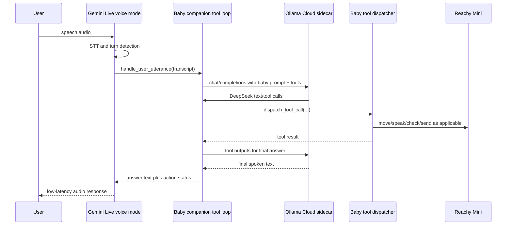

# Baby Companion Gemini Live Tool Loop Integration

## Summary

Patch the architecture so Gemini Live is the low-latency voice front-end for the
existing baby companion app, not a standalone replacement for it. The proper
implementation keeps the baby app's prompt, tool specifications, physical robot
actions, safety checks, Signal integrations, and feature flags as the source of
truth. Gemini Live should own microphone streaming, turn-taking, STT, TTS, and
audio playback. The baby companion should still own the reasoning/tool loop that
calls the Ollama Cloud sidecar and dispatches baby app tools.

This is a correction to the completed standalone plan in
`docs/plans/2026-05-04-001-feat-gemini-live-deepseek-voice-plan.md`. That plan
intentionally scoped out full baby feature parity; this plan makes parity the
point of the next patch.

## Problem Frame

The current `gemini-deepseek-companion` app is fast enough for voice, but it is
not the baby companion. Its Gemini Live session exposes only
`ask_companion_brain`, and its runtime only starts robot media input/output. It
does not load the baby companion's tool dependencies, tool specs, action
dispatcher, movement manager, cry/danger checks, Signal behavior, or profile
prompt. As a result, Reachy can claim she can wave or dance while no matching
physical tool exists in that app path.

The proper sidecar design is:

- Gemini Live: voice front-end.
- Baby companion app: persona, conversation policy, tool loop, and robot
  capability dispatcher.
- Ollama Cloud sidecar: OpenAI-compatible cloud brain endpoint for DeepSeek.

The sidecar already preserves OpenAI-compatible request fields, including tool
fields, when forwarding to Ollama Cloud. The missing piece is in the voice app:
the Gemini tool call must invoke the baby app's existing tool loop, not a plain
text-only sidecar request.

## Requirements

- R1: Gemini mode must preserve existing baby app capabilities exposed through
  the baby companion's tool specs, including physical actions such as movement
  and dance when those tools are enabled.
- R2: Gemini Live must remain the voice front-end for mic audio, input
  transcription, turn-taking, output audio, and playback.
- R3: DeepSeek through the local Ollama Cloud sidecar remains the reasoning
  brain; Gemini must not become the action planner.
- R4: The baby app's existing prompt/profile and feature flags must be reused so
  cloud voice mode behaves like the baby companion, not a new persona.
- R5: Local-mode behavior must remain intact as the fallback path.
- R6: The app must not claim a physical capability was performed unless the
  corresponding tool dispatch succeeded or returned a clear unavailable result.
- R7: Secrets must stay in robot-local environment/config files and must not be
  logged or committed.
- R8: Robot validation must prove at least one spoken answer and one physical
  action through the Gemini voice path.

## Scope

Primary target:

- `baby-reachy-mini-companion` fork or deployment overlay.

Secondary target:

- `reachy-ollama-cloud-sidecar` remains the sidecar and deployment-support repo.
  It should keep the existing `/v1/chat/completions` contract stable unless a
  test proves the baby app tool loop needs a sidecar compatibility patch.

In scope:

- Add a Gemini Live voice mode to the baby companion app.
- Route each user utterance through a local Gemini Live function such as
  `handle_user_utterance`.
- Implement `handle_user_utterance` by reusing the baby companion's
  OpenAI-compatible LLM/tool loop with the sidecar as the model endpoint.
- Reuse the baby companion's existing `ToolDependencies`, tool specs, tool
  dispatch, prompt/profile loader, feature flags, and safety gating.
- Adapt the baby app's `speak` tool for Gemini mode so spoken text is returned
  to Gemini Live instead of being sent to the local TTS path.
- Keep the standalone `gemini-deepseek-companion` app as temporary fallback
  until the integrated baby path is validated on the robot.
- Update deployment docs so the installed robot app is the Gemini-enabled baby
  companion, not only the standalone app.

Out of scope:

- Upstream PR to `ravediamond/baby-reachy-mini-companion`.
- New robot gestures beyond what the baby app already supports.
- Rebuilding the local STT/TTS pipeline.
- Replacing DeepSeek with Gemini as the brain.
- Expanding the sidecar API beyond OpenAI-compatible forwarding unless required
  by characterization tests.

## Existing Evidence

Current sidecar repo evidence:

- `python/reachy_gemini_deepseek_companion/src/reachy_gemini_deepseek_companion/live_handler.py`
  declares only `ask_companion_brain`.
- `python/reachy_gemini_deepseek_companion/src/reachy_gemini_deepseek_companion/main.py`
  only wires robot media input/output to the Gemini Live handler.
- `python/reachy_gemini_deepseek_companion/src/reachy_gemini_deepseek_companion/brain_client.py`
  sends plain non-tool chat completion requests to the sidecar.
- `src/route-chat-completions.ts` forwards the request body to Ollama Cloud with
  only the model rewritten, so baby app tool fields can flow through the sidecar.

Upstream baby companion evidence:

- `src/reachy_mini_conversation_app/local/handler.py` owns the local
  conversation loop and dispatches tool calls through `dispatch_tool_call`.
- `src/reachy_mini_conversation_app/local/llm.py` sends OpenAI-compatible chat
  requests with `tools` and `parallel_tool_calls=False`.
- `src/reachy_mini_conversation_app/tools/core_tools.py` provides
  `ToolDependencies`, `get_tool_specs`, and `dispatch_tool_call`.
- `src/reachy_mini_conversation_app/profiles/default/tools.txt` lists baby app
  capabilities such as `dance`, `move_head`, `speak`, `story_time`,
  `soothe_baby`, `check_baby_crying`, and `check_danger`.

External API evidence:

- Gemini Live supports real-time audio sessions over the Google GenAI SDK.
- Gemini Live supports function calling, but the client must execute calls and
  send `FunctionResponse` objects back with `send_tool_response`.

## Key Decisions

- D1: Integrate inside the baby companion app instead of extending the
  standalone `gemini-deepseek-companion`.
  - Rationale: the baby companion already owns the action dependencies and
    feature gates. Recreating those in the standalone app will drift quickly and
    is exactly how the current capability gap happened.
- D2: Expose one Gemini Live function for utterance handling, not all physical
  baby tools directly to Gemini.
  - Rationale: Gemini is the voice front-end. DeepSeek plus the baby companion
    prompt/tool loop should remain the action planner. This keeps behavior close
    to the existing baby app and avoids two models competing over tool policy.
- D3: Reuse or extract the baby app's existing tool-loop orchestration.
  - Rationale: `LocalSessionHandler` already handles iterative tool calls,
    tool outputs, feature exclusions, and max-turn behavior. Gemini mode should
    share that logic instead of copying it into a parallel implementation.
- D4: Treat the `speak` tool as the main compatibility edge.
  - Rationale: in local mode, `speak` can call local TTS. In Gemini mode, Gemini
    owns TTS, so `speak` must append/return text for the final Gemini response
    rather than playing local audio directly.
- D5: Make robot validation capability-based, not just latency-based.
  - Rationale: the regression is not speed. The regression is loss of baby app
    capability dispatch.

## Proposed Design

Gemini Live receives microphone audio and is instructed to call
`handle_user_utterance` for every user utterance. That local function passes the
transcript into the baby companion's existing conversation/tool loop. The tool
loop calls the sidecar using the OpenAI-compatible contract and existing baby
tool specs. If DeepSeek requests a tool, the baby app dispatches it locally
through the same dependencies used by local mode. The final text returns to
Gemini Live, which speaks it.

## Implementation Units

### U1: Fork/Overlay Target and Mode Selection

Goal: make the Gemini implementation land where the baby companion app can
actually reuse its capabilities.

Files:

- `pyproject.toml`
- `src/reachy_mini_conversation_app/config.py`
- `src/reachy_mini_conversation_app/main.py`
- `tests/test_config.py`
- `tests/test_app_mode_selection.py`

Approach:

- Add a voice front-end mode setting such as `VOICE_FRONTEND=local|gemini_live`.
- Keep `local` as the default to avoid surprising upstream/local behavior.
- Require `GEMINI_API_KEY` only when `gemini_live` mode is selected.
- Keep existing sidecar/OpenAI-compatible settings as the brain endpoint for
  Gemini mode.
- Do not remove the current local STT/TTS mode.

Test scenarios:

- Default config selects local mode.
- Gemini mode fails fast with a clear error when `GEMINI_API_KEY` is missing.
- Gemini mode accepts configured model, voice, sidecar base URL, and model name.
- Existing local app entry point still imports without Gemini dependencies.

### U2: Shared Baby Tool Loop Service

Goal: allow local mode and Gemini mode to share the same brain/tool execution
logic.

Files:

- `src/reachy_mini_conversation_app/conversation/tool_loop.py`
- `src/reachy_mini_conversation_app/local/handler.py`
- `src/reachy_mini_conversation_app/local/llm.py`
- `tests/conversation/test_tool_loop.py`

Approach:

- Extract the iterative "send prompt + tools, dispatch tool calls, send tool
  outputs, collect final text" behavior from the local handler into a reusable
  service.
- Keep the OpenAI-compatible LLM client responsible for streaming/parsing model
  events.
- Keep max-turn behavior and feature-based tool exclusions consistent with
  existing local mode.
- Preserve the sidecar request shape, including `tools` and
  `parallel_tool_calls=False`.

Test scenarios:

- A plain model text response returns final text with no tool dispatch.
- A model `move_head` tool call dispatches through `dispatch_tool_call` and feeds
  the tool output back to the model for a final response.
- Multiple tool turns stop at the existing max-turn limit.
- Feature-disabled tools are excluded from the tool specs.
- Sidecar-facing requests still include tool declarations and
  `parallel_tool_calls=False`.

### U3: Gemini Live Voice Front-End

Goal: add a Gemini Live handler that uses the baby tool loop as its only local
function.

Files:

- `src/reachy_mini_conversation_app/gemini_live/handler.py`
- `src/reachy_mini_conversation_app/gemini_live/audio.py`
- `tests/gemini_live/test_handler.py`
- `tests/gemini_live/test_audio.py`

Approach:

- Build a Gemini Live session config with audio response modality, input/output
  transcription, voice config, and one function declaration:
  `handle_user_utterance`.
- Force the Gemini system instruction to call `handle_user_utterance` for every
  user message and speak returned text rather than answering from Gemini's own
  reasoning.
- Stream robot microphone PCM into Gemini Live and queue Gemini output PCM back
  to robot media playback.
- Log transcript, brain/tool-loop start/end, and response completion timings
  without logging secrets.

Test scenarios:

- Live config includes the single utterance-handling function declaration.
- Live config does not expose physical robot tools directly to Gemini.
- A Gemini `handle_user_utterance` tool call invokes the shared baby tool loop.
- Unknown Gemini function calls return a clear error response.
- Audio conversion accepts robot input rates and emits Gemini-compatible PCM.

### U4: Gemini-Compatible `speak` Tool Handling

Goal: make baby app speech tools work when Gemini owns TTS.

Files:

- `src/reachy_mini_conversation_app/tools/core_tools.py`
- `src/reachy_mini_conversation_app/conversation/speech_sink.py`
- `tests/tools/test_speak_tool.py`
- `tests/conversation/test_speech_sink.py`

Approach:

- Add a small speech sink abstraction or equivalent dependency hook used by the
  existing `speak` tool.
- Local mode keeps the current local TTS behavior.
- Gemini mode captures requested speech text and returns it as part of the final
  Gemini response contract.
- Tool results should distinguish "speech queued for Gemini" from physical
  action failures.

Test scenarios:

- Local mode `speak` still calls the existing local speech function.
- Gemini mode `speak` captures text without invoking local TTS.
- Multiple `speak` tool calls preserve order.
- Failed speech sink behavior returns a tool result that the brain can report.

### U5: Capability Grounding and Prompt Guardrails

Goal: prevent Reachy from claiming actions that did not happen.

Files:

- `src/reachy_mini_conversation_app/prompts.py`
- `src/reachy_mini_conversation_app/profiles/default/system.txt`
- `src/reachy_mini_conversation_app/conversation/tool_loop.py`
- `tests/conversation/test_capability_grounding.py`

Approach:

- Add or preserve prompt language that says physical actions must be performed
  through tools before being claimed.
- Ensure tool failures and unavailable tools are visible in tool outputs passed
  back to the brain.
- Keep the final response grounded in tool results.
- Avoid Gemini-specific physical capability claims in the Gemini Live voice
  instruction; Gemini should only speak the baby loop's returned text.

Test scenarios:

- If a movement tool succeeds, the final model turn receives that success result.
- If a movement tool fails, the final model turn receives the failure result.
- Gemini Live system instruction does not list unsupported physical claims.
- A disabled tool is not advertised to the brain.

### U6: Deployment and Robot Validation

Goal: install and prove the corrected baby app path on Reachy Mini.

Files:

- `deploy/install_baby_gemini_live_companion.sh`
- `deploy/baby-gemini-live.env.example`
- `docs/robot-validation.md`
- `README.md`

Approach:

- Update deployment docs so the installed app is the Gemini-enabled baby
  companion.
- Keep the sidecar service as a prerequisite and document the sidecar health
  check.
- Include a rollback path to local mode and to the current standalone Gemini app
  while validation is ongoing.
- Add validation steps that capture logs for transcript timing, sidecar timing,
  tool dispatch timing, and robot action proof.

Test scenarios:

- Import smoke succeeds in the robot app environment.
- The app appears in Reachy Mini's app list or starts through the documented
  service path.
- Asking "move your head" or "dance" triggers the existing baby tool dispatcher
  and visible robot movement.
- Asking a normal question produces fast Gemini audio output.
- Restarting the app preserves Gemini mode configuration.
- Disabling Gemini mode returns the app to local behavior.

## Sidecar Compatibility Checks

The sidecar should not need architectural changes for this patch, but add or
retain characterization coverage before assuming that:

- `tests/route-chat-completions.test.ts` verifies request `tools` survive
  forwarding to Ollama Cloud.
- `tests/route-chat-completions.test.ts` verifies `parallel_tool_calls` survives
  forwarding.
- `tests/request-classifier.test.ts` verifies the baby companion model alias
  still routes to the intended cloud model.
- A manual or scripted smoke sends a tool-bearing request to the sidecar and
  confirms the upstream request body preserves the tool contract.

If these checks fail, patch the sidecar narrowly in `src/route-chat-completions.ts`
or `src/request-classifier.ts`. Do not add a separate sidecar tool-dispatch
layer; tool dispatch belongs in the baby companion process where robot
dependencies exist.

## Dependencies and Sequencing

1. Characterize the baby app local tool loop and write tests around its current
   OpenAI-compatible request and dispatch behavior.
2. Extract or wrap the shared tool-loop service without changing local behavior.
3. Add Gemini Live mode with `handle_user_utterance` calling the shared tool
   loop.
4. Adapt `speak` behavior for Gemini mode.
5. Add capability-grounding tests and prompt/config guardrails.
6. Update deployment docs and install the Gemini-enabled baby app on the robot.
7. Run robot validation for voice speed plus physical actions.
8. Only after validation, decide whether to deprecate the standalone
   `gemini-deepseek-companion` app.

## Risks

- Gemini may still answer directly if prompt/tool enforcement is weak.
  Mitigation: expose exactly one Gemini function, log bypasses, and test
  function-call handling.
- The `speak` tool may create duplicate or out-of-order speech in Gemini mode.
  Mitigation: route all Gemini-mode speech through one ordered speech sink.
- DeepSeek/Ollama Cloud may return malformed or unsupported tool calls.
  Mitigation: preserve the existing parser safeguards and return explicit tool
  errors to the model.
- Robot media and movement may contend for resources.
  Mitigation: validate on hardware with timing logs and keep action dispatch
  asynchronous where the baby app already does so.
- Upstream baby app may change quickly.
  Mitigation: keep this in a fork/deployment overlay first, and avoid a broad
  upstream PR until the architecture is proven.

## Open Questions

- Should this land in a fork of `baby-reachy-mini-companion`, or should this
  repo vendor the baby app as a deployment overlay?
  - Recommended answer: fork the baby app. Vendoring into this repo increases
    drift and hides the fact that the baby app is the real application.
- Should Gemini ever see camera/video input directly?
  - Recommended answer: no for this patch. Keep vision checks in baby app tools
    so capability policy stays in one place.
- Should the standalone `gemini-deepseek-companion` app be removed immediately?
  - Recommended answer: no. Keep it as rollback until Gemini-enabled baby app
    validation proves speech plus physical actions.

## Verification Checklist

- Python unit tests for config, mode selection, Gemini handler, shared tool loop,
  `speak` adaptation, and capability grounding.
- TypeScript sidecar tests confirming tool-bearing requests are forwarded
  intact.
- Robot import smoke for the Gemini-enabled baby app.
- Robot app visibility or service-start proof.
- Robot log proof for:
  - Gemini input transcript received.
  - Baby tool loop invoked.
  - Sidecar request started and finished.
  - A physical action tool dispatched successfully.
  - Gemini output audio completed.
- Manual hardware proof for at least one physical action through voice.

## External References

- Gemini Live API SDK guide:
  `https://ai.google.dev/gemini-api/docs/live-api/get-started-sdk`
- Gemini Live tool-use guide:
  `https://ai.google.dev/gemini-api/docs/live-api/tools`
- Baby companion upstream:
  `https://github.com/ravediamond/baby-reachy-mini-companion`
- Baby companion mirror inspected during planning:
  `https://huggingface.co/spaces/ravediamond/baby-reachy-mini-companion/tree/main`
