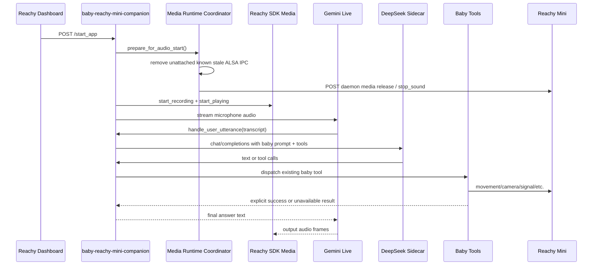

# Stabilize Baby Companion Gemini Runtime Media

## Summary

Finish the proper patch by making `baby-reachy-mini-companion` the app users
launch for Gemini Live + DeepSeek, with the existing baby tool loop intact. The
remaining work is not another voice app. It is a runtime/media hardening pass:
coordinate Reachy daemon media ownership, avoid stale ALSA state, stop relying
on unstable numeric mic devices, and prove that voice, camera, and physical
tools still work through the baby app path.

The standalone `gemini-deepseek-companion` app remains only a rollback and
diagnostic path. It is fast, but it does not load the baby app's movement,
camera, cry/danger, Signal, profile, or tool-dispatch capabilities.

## Problem Frame

The baby app now has the intended architecture:

- `GeminiLiveSessionHandler` owns Gemini Live STT/turn-taking/TTS.
- `ConversationToolLoop` keeps DeepSeek through the Ollama Cloud sidecar as the
  reasoning brain.
- `ToolDependencies`, `get_tool_specs`, and `dispatch_tool_call` preserve the
  baby app's capabilities.

The failure is at the robot runtime boundary. On the Reachy Mini, the daemon
often holds media devices before the app starts audio, and stale ALSA IPC can
leave `reachymini_audio_sink` unusable. Direct mic selection through numeric
SoundDevice indexes also drifted between runs, causing the UI to start a direct
loopback recorder that produced frames but no useful user turns.

The proper patch should make the app-start path deterministic from the Reachy
Mini dashboard: start `baby-reachy-mini-companion`, click start, speak, get a
Gemini Live response, and ask for an existing baby capability such as head
movement or camera without switching to the fallback sidecar app.

## Requirements

- R1: `baby-reachy-mini-companion` remains the primary app entry point for this
  experience.
- R2: Gemini Live remains the voice front-end, while DeepSeek through the
  sidecar remains the baby companion brain.
- R3: The existing baby tool specs and dispatcher remain the only place robot
  capabilities are exposed and executed.
- R4: Starting from the dashboard must not require manual `ipcrm`, daemon
  restarts, or SSH-only media release commands.
- R5: The default audio path must use the Reachy SDK media backend, not a
  persisted numeric SoundDevice input index.
- R6: If direct microphone mode remains available, it must be explicit,
  clearly labeled, and non-default.
- R7: Audio startup must release or stop daemon-held media at the correct time:
  after app/SDK initialization and before app recording/playback starts.
- R8: The patch must not silently break camera-based tools. If a camera frame is
  unavailable, the tool result must say that clearly rather than letting the
  model claim vision worked.
- R9: Shutdown should leave the daemon/app manager in a recoverable state, with
  media closed and logs explaining any daemon reacquire fallback.
- R10: Robot validation must prove a spoken answer, at least one physical tool,
  and one camera/tool-availability result through the baby app Gemini path.

## Scope Boundaries

In scope:

- Runtime media coordination inside `baby-reachy-mini-companion`.
- Safe startup cleanup for stale Reachy ALSA IPC objects.
- Dashboard settings changes that prevent unstable mic-device persistence.
- Tests around media startup ordering, config persistence, playback guards, and
  Gemini tool-loop preservation.
- Robot deployment and hardware validation for the baby app.

Out of scope:

- Replacing DeepSeek with Gemini as the reasoning/action model.
- Adding new robot gestures or capabilities beyond the existing baby tools.
- Rebuilding the standalone `gemini-deepseek-companion` app into the final
  product path.
- Opening an upstream PR to `ravediamond/baby-reachy-mini-companion`.
- Deleting attached ALSA IPC segments or changing system daemon code unless a
  narrow daemon bug is separately proven.

## Assumptions

- The sidecar endpoint remains `http://127.0.0.1:11435/v1` with model
  `reachy-companion`, and that alias routes to the intended Ollama Cloud model.
- The robot app manager continues to inject an initialized `ReachyMini` object
  before `ReachyMiniConversationApp.run()` calls `run(...)`.
- The daemon media API routes observed in the sidecar patch are available on the
  target robot.
- Camera behavior after daemon media release needs one more characterization
  pass before choosing between continuous camera worker recovery and on-demand
  capture recovery.

## Current Evidence

- `main.py` already selects `GeminiLiveSessionHandler` when
  `VOICE_FRONTEND=gemini_live`, preserving the baby app dependency graph.
- `gemini_live/handler.py` exposes one Gemini function,
  `handle_user_utterance`, and routes the transcript into
  `ConversationToolLoop`.
- `local/llm.py` already sends `reasoning_effort="none"`, which is required for
  the DeepSeek/Ollama Cloud response to contain normal answer text in this
  voice path.
- `console.py` now guards invalid playback sample rates and zero-length
  resample frames.
- The fallback sidecar app proved that releasing daemon media immediately before
  `start_recording()` and `start_playing()` lets the app own
  `/dev/snd/pcmC0D0c` and `/dev/snd/pcmC0D0p`.
- Robot logs showed numeric mic indexes are unstable; direct loopback mode can
  produce frame counts without producing user transcripts or answers.
- Robot inspection showed stale unattached ALSA IPC objects can block playback,
  and clearing only unattached Reachy IPC objects restored direct speaker
  output.

## Key Decisions

- D1: Patch the baby app runtime, not the standalone sidecar app.
  - Rationale: the baby app already owns movement, camera, safety checks,
    feature flags, and profile prompts.
- D2: Keep the SDK media backend as the default audio path.
  - Rationale: direct SoundDevice indexes are hardware-order dependent and
    caused a silent non-response failure on the robot.
- D3: Perform daemon media release inside the app lifecycle, not as a deploy
  instruction.
  - Rationale: release before SDK/app initialization can break app startup, but
    release after initialization and before audio start was proven on hardware.
- D4: Make stale IPC cleanup conservative and observable.
  - Rationale: clearing unattached known Reachy IPC objects is useful; deleting
    attached shared memory or semaphores is unsafe.
- D5: Treat camera preservation as a first-class acceptance criterion.
  - Rationale: audio release can affect camera pipelines, and losing camera
    would recreate the same capability-gap problem under a different name.
- D6: Improve logs and status endpoints enough that future failures identify
  the selected audio mode, media handoff result, IPC cleanup result, and tool
  path without guessing from the dashboard.

## Proposed Design

## Implementation Units

### U1: Media Runtime Coordinator

Goal: centralize the robot-specific media handoff instead of scattering daemon
release and IPC cleanup logic through `console.py`.

Files:

- `src/reachy_mini_conversation_app/media_runtime.py`
- `src/reachy_mini_conversation_app/config.py`
- `tests/test_media_runtime.py`

Approach:

- Add a small coordinator that can:
  - POST daemon media release and stop-sound requests with short timeouts.
  - Detect Linux support for `ipcs` / `ipcrm`.
  - Remove only known Reachy audio IPC keys when they are unattached.
  - Return structured status for logs and `/app_state`.
- Add config flags for daemon media release and stale IPC cleanup, defaulting on
  for the Reachy Mini app runtime and off or no-op when unsupported.
- Keep the helper standard-library only so importing the app does not add new
  robot package requirements.

Test scenarios:

- Daemon release success and HTTP failure are both logged without crashing app
  startup.
- IPC cleanup ignores attached shared memory.
- IPC cleanup ignores unknown keys.
- Missing `ipcs` / `ipcrm` degrades to a no-op with a warning.
- Config defaults are safe for local development and active for robot runtime.

### U2: Audio Startup Ordering

Goal: call the media coordinator at the only timing that worked on hardware:
after app setup and before SDK recording/playback starts.

Files:

- `src/reachy_mini_conversation_app/console.py`
- `tests/test_console_media_startup.py`

Approach:

- Instantiate the coordinator in `LocalStream`.
- Before any SDK media start, call `prepare_for_audio_start()` immediately
  before `robot.media.start_recording()` and/or `robot.media.start_playing()`.
  This includes direct mic mode because playback still uses SDK media.
- Do not call daemon release before `ReachyMiniConversationApp.run()` has
  initialized the robot and registered dashboard routes.
- Keep shutdown in the same async loop that started media, then close media and
  record whether daemon reacquire is available or needs an external daemon
  restart fallback.

Test scenarios:

- SDK mode calls media preparation before `start_recording()` and
  `start_playing()`.
- Direct mic mode does not start SDK recording but still starts SDK playback.
- Preparation failure logs status and still tries the SDK media start once.
- `close()` cancels tasks and media stop happens from the async loop.

### U3: Stable Audio Mode Selection

Goal: prevent the dashboard from selecting a stale numeric mic device by
default.

Files:

- `src/reachy_mini_conversation_app/console.py`
- `src/reachy_mini_conversation_app/static/index.html`
- `src/reachy_mini_conversation_app/static/main.js`
- `tests/test_main_config.py`

Approach:

- Add an explicit "Reachy SDK audio" option whose submitted `MIC_DEVICE` value
  is empty.
- Make SDK audio the default even when `/audio_devices` reports a PortAudio
  default.
- Preserve direct mic testing as a diagnostic path, but label it as direct
  input and avoid persisting numeric device indexes unless the user explicitly
  selects one for that session.
- Persist `MIC_GAIN`, but do not persist `MIC_DEVICE` as a normal app setting.

Test scenarios:

- `/start_app` with empty `MIC_DEVICE` selects SDK mode.
- `/start_app` with a numeric `MIC_DEVICE` selects direct mode for that run.
- LLM settings persistence does not write `MIC_DEVICE`.
- UI initialization leaves the SDK option selected by default.

### U4: Camera Capability Preservation

Goal: keep camera-backed baby tools honest and, where possible, functional
after the audio media handoff.

Files:

- `src/reachy_mini_conversation_app/camera_worker.py`
- `src/reachy_mini_conversation_app/tools/camera.py`
- `src/reachy_mini_conversation_app/console.py`
- `tests/test_camera_worker.py`
- `tests/tools/test_camera_tool.py`

Approach:

- Characterize camera frame availability before and after daemon media release
  on the robot.
- If frames continue through SDK media, add a readiness check so the app logs
  the first post-handoff frame.
- If release causes camera end-of-stream, restart or refresh the camera worker
  after audio media start and verify fresh frames before marking camera ready.
- If camera recovery is not reliable in the same process, change the camera
  tool to return a clear unavailable result and keep the prompt/tool loop
  grounded in that result for this patch.
- Do not let Gemini or DeepSeek claim visual inspection happened when
  `CameraWorker` has no usable frame.

Test scenarios:

- Camera tool returns an explicit error when no frame is buffered.
- Camera tool uses a fresh buffered frame when one is available.
- Camera worker can recover from transient `get_frame()` errors without tight
  error loops.
- Tool-loop tests preserve unavailable camera results in the model-visible tool
  output.

### U5: Gemini Tool Loop Regression Coverage

Goal: lock in the architectural fix so future runtime patches do not drift back
to a text-only sidecar app.

Files:

- `src/reachy_mini_conversation_app/gemini_live/handler.py`
- `src/reachy_mini_conversation_app/conversation/tool_loop.py`
- `src/reachy_mini_conversation_app/local/llm.py`
- `tests/gemini_live/test_handler.py`
- `tests/conversation/test_tool_loop.py`
- `tests/test_local_llm.py`

Approach:

- Keep Gemini Live exposing one utterance-handling function.
- Assert that the utterance handler runs `ConversationToolLoop` with baby tool
  specs and baby dispatch.
- Preserve `reasoning_effort="none"`, `tools`, and
  `parallel_tool_calls=False` on the OpenAI-compatible request.
- Keep `speak` tool capture behavior in Gemini mode so Gemini remains the only
  voice output path.

Test scenarios:

- Gemini tool call invokes the baby tool loop once per user utterance.
- A model tool call is dispatched through baby `dispatch_tool_call`.
- Final answer text is returned to Gemini for speech.
- `reasoning_effort` remains disabled for the sidecar brain request.

### U6: Deployment Hygiene and Robot Validation

Goal: make the installed app match the intended path and prove it on hardware.

Files:

- `README.md`
- `docs/robot-validation.md`
- deployment docs/scripts already used for Reachy Mini app install

Approach:

- Document that the launch target is `baby-reachy-mini-companion`.
- Document the fallback role of `gemini-deepseek-companion` and avoid treating
  it as the final app.
- Include sidecar health checks, app config expectations, and the media
  validation commands used during debugging.
- After deploy, verify:
  - app manager shows the baby app running,
  - `/app_state` reports running,
  - logs show SDK audio mode and media handoff status,
  - logs show user transcript,
  - logs show baby tool-loop start/end,
  - logs show a physical tool result,
  - logs show camera ready or a clear camera-unavailable result.

Robot validation scenarios:

- Normal spoken question receives a fast audio answer.
- "Move your head" or equivalent triggers the existing movement tool and
  visible robot motion.
- "What do you see?" either uses a fresh camera frame or clearly says camera is
  unavailable through the tool result.
- Stop and restart from the dashboard without manual SSH cleanup.

## Dependencies and Sequencing

1. Add media-runtime unit tests and coordinator without wiring it into startup.
2. Wire coordinator into SDK audio startup and add startup-order tests.
3. Patch UI/settings so SDK audio is the default and numeric mic devices are
   explicit diagnostics.
4. Characterize and patch camera behavior after media handoff.
5. Add or update Gemini tool-loop regression tests.
6. Deploy the baby app to Reachy Mini.
7. Stop the fallback `gemini-deepseek-companion` service/app during validation.
8. Validate voice, movement, camera availability, stop, and restart from the
   dashboard.

## Risks

- Daemon media release may still disrupt camera.
  - Mitigation: characterize camera immediately after handoff and make camera
    recovery or explicit unavailability part of the patch.
- IPC cleanup can be dangerous if too broad.
  - Mitigation: only remove known Reachy keys that are unattached, and log every
    skipped object.
- SDK audio startup may still fail when stale ALSA state is owned by another
  process.
  - Mitigation: log `lsof`/IPC diagnostics in validation and stop the fallback
    app before starting baby validation.
- Gemini may answer directly if the function-call contract regresses.
  - Mitigation: regression tests keep one Gemini function and assert the baby
    tool loop handles the utterance.
- Shutdown may leave dashboard media disconnected.
  - Mitigation: close app media cleanly, verify restart behavior, and document
    daemon restart as fallback only if no daemon reacquire route exists.

## Verification Checklist

- `uv run ruff check src tests`
- `uv run pytest tests/test_media_runtime.py tests/test_console_media_startup.py`
- `uv run pytest tests/test_console_playback.py tests/test_local_llm.py`
- `uv run pytest tests/gemini_live/test_handler.py tests/conversation/test_tool_loop.py`
- Robot deploy proof showing installed baby app commit.
- Robot log proof for media handoff and selected SDK audio mode.
- Robot log proof for Gemini transcript and baby tool loop invocation.
- Hardware proof for one spoken answer and one physical movement tool.
- Camera tool proof, either with a fresh frame or an explicit unavailable result.
- Stop/restart proof from the Reachy dashboard with no manual `ipcrm`.

## Rollback

- Stop `baby-reachy-mini-companion`.
- Start the previously working `gemini-deepseek-companion` fallback if fast voice
  interaction is needed without baby tool parity.
- Revert only the media-hardening commits if they cause startup regressions,
  retaining the already validated DeepSeek `reasoning_effort` and playback
  guards when possible.

## Follow-Up Work

- Decide whether to remove or hide the standalone fallback app after the baby
  Gemini path is stable across several restarts.
- Add a robot-side smoke script that captures media ownership, IPC state, app
  logs, and `/app_state` into one artifact.
- Consider a daemon-level media reacquire fix only if app-level shutdown cannot
  reliably restore dashboard media.
